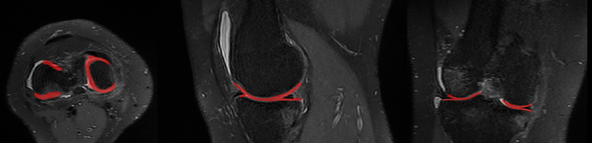

# 3D knee segmengtation using deep learning

This is a repository containing code of 3D Deep  Residual-Unet Networks for Volumetric knee cartilage Segmentation.



## Dataset

3D data of knee are used with ```255 * 255 * 216``` size and a manually created 3D segmentation label controled by experts.


Training-data are divided into two sub-directories:

* __ct__: contains the input images.

* __seg__: contains the output images (ground truth).

## Getting Started

### Requirements

```
python 3.6
SimpleITK
numpy
pandas
scipy
```

### Step 1: Preparing dataset 

```bash
python get_training_set.py
```

### Step 2: Train ResUnet

```bash
python train.py
```

### Step 3: Test ResUnet

```bash
python test.py
```

>  **parameter.py**, contain all the parameter, so first set dataset path of your own. 
after the model is well trained, run **test.py** to test the model.


## Author : 
Mathlouthi Safa

## contact : 
mathlouthisafa94@gmail.com